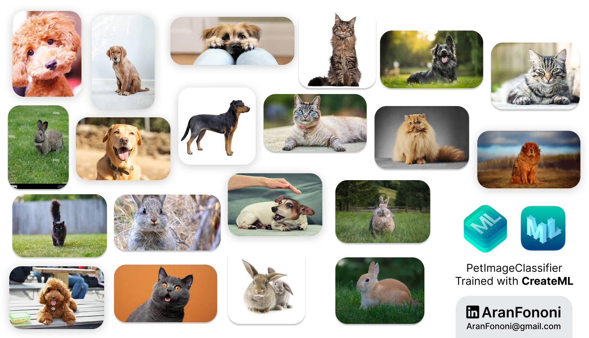

# Animal Classifier AI Model 🐶🐱🐰

### Section 25: Machine Learning Model for Animal Classification

The **Animal Classifier** is a machine learning model built using Create ML to recognize and differentiate between common pets: dogs, cats, and rabbits. This model was developed and trained on labeled images to make accurate predictions.

## Project Overview
Using Apple's Create ML, this project focuses on image classification of pets, leveraging CoreML to develop a model that can be integrated into iOS applications for quick and effective animal recognition.

## Learning Outcomes
- **Model Training with Create ML**: Gained experience in training and evaluating machine learning models for specific image classification tasks.
- **Dataset Preparation**: Learned how to prepare and label datasets to improve model accuracy.
- **Model Optimization**: Experimented with training parameters to achieve the highest accuracy possible with minimal resource requirements.

## Key Skills
- Training custom image classification models
- Testing and refining model performance
- Deploying Core ML models for mobile use

## Additional Features
- **Cross-platform Usability**: The model can be integrated into various iOS applications with Core ML support.
- **High Accuracy**: The classifier was fine-tuned to minimize false positives, making it reliable for practical use.

---

### Project Preview
*(No specific iOS app preview as this is a standalone model)*

---

### Footer

---

## Contact
For more information, feel free to reach out:  
- **Email**: [aranfononi@gmail.com](mailto:aranfononi@gmail.com)  
- **LinkedIn**: [Aran Fononi](https://www.linkedin.com/in/aran-fononi-18182b265)
